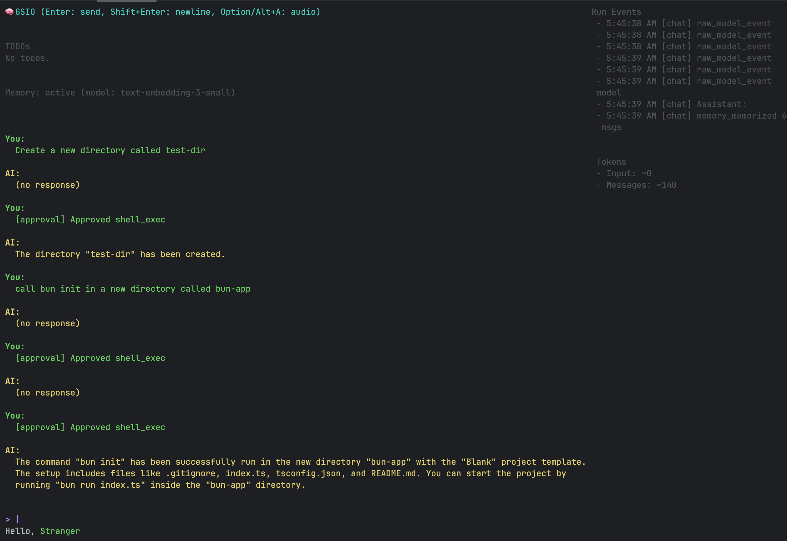

# gsio
[](https://www.npmjs.com/package/gsio)

[](https://opensource.org/licenses/MIT)

**Embrace Chaos** - *BYO Mechatronics*

> Expect breaking changes! Early release under active development. If something isn't working, try stepping back a version. e.g `bunx gsio@0.1.10 <optional-subcommand>`




> Little to no thought was put into aesthetics because nobody cares what it looks like if it doesn't work well.
> On a related note, *I have a vision*, of piping stdout to the display of Rayban Wayfarer glasses.


## Install

You can either run this as a CLI, with full access to your system, or as a container for stronger isolation from the host.
```bash
$ npx gsio chat
```


## Run with Docker

You can run `gsio` in a container without installing Node/Bun locally. The container image is published to GitHub Container Registry.

- Registry image: `ghcr.io/geoffsee/gsio:latest-alpine`

### Quick start (one-off run)

This starts an interactive session and uses your current directory to store `.gsio-config.json` and any local data so it persists on your machine:

```bash
# macOS/Linux
OPENAI_API_KEY=sk-... \
  docker run --rm -it \
  -e OPENAI_API_KEY="$OPENAI_API_KEY" \
  -v "$(pwd):/your-proj-dir" -w /workspace \
  ghcr.io/geoffsee/gsio:latest-alpine
```

Tips:
- Use `-v "$(pwd):/workspace" -w /workspace` so config and data live in your project folder (or any folder you choose).
- You can pass other environment variables the same way with `-e NAME=value`.

### With Docker-managed volume (isolated data)

If you prefer Docker to manage the data volume instead of binding your host folder, use a named volume mounted at `/data`:

```bash
docker volume create gsio-data
OPENAI_API_KEY=sk-... \
  docker run --rm -it \
  -e OPENAI_API_KEY="$OPENAI_API_KEY" \
  -v gsio-data:/data \
  ghcr.io/geoffsee/gsio:latest-alpine
```

Note: By default `gsio` stores `.gsio-config.json` in the current working directory. When using the `/data` volume, you can `cd /data` after the container starts, or mount a working directory with `-w /data` to keep config inside the volume.

### Using Docker Compose

A ready-to-use `compose.yml` is included.

1. Create a file named `.env.secrets` next to `compose.yml` with your API key:
   ```env
   OPENAI_API_KEY=sk-...
   ```
2. Start an interactive session via Compose:
   ```bash
   docker compose run --rm -it gsio
   ```
   This will use the image tag referenced in `compose.yml` and mount a Docker-managed volume named `gsio-data` at `/data`.

If you prefer a long-running container, you can do:
```bash
docker compose up -d
# then attach an interactive shell and start the CLI
docker exec -it gsio ./cli.js
```

### Build the image locally (optional)

If you want to build the image yourself (multi-arch) and tag `latest-alpine`:

```bash
# requires docker buildx and jq
npm run container:build
# push (optional)
npm run container:push
```

The build uses the `Containerfile` and produces tags like `<version>-<hash>-alpine` and `latest-alpine`.

## CLI

```
$ gsio --help

  Usage
    $ gsio

  Description
    Start an interactive AI chat in your terminal. Type your message and press Enter to send. The assistant can use tools (calculator, file read/list, HTTP GET, todo management, shell_exec).

  Environment
    Defaults to OpenAI. Can be switched to Ollama (offline) via config.

  Options
    --name  Optional greeting name (shown at the top)
    --debug Enable input debugging (logs key info)

  Examples
    $ gsio
    $ gsio config
    $ gsio --debug
    $ OPENAI_API_KEY=sk-... gsio
```

## Features

- Chat in your terminal with streaming responses.
- Built‑in tools: calculator, file read/list, HTTP GET, TODO management, shell_exec.
- Project TODOs with status, priority, dependencies, notes, focus, and planning.
- Interactive config menu: `gsio config`.
- Optional audio context with continuous capture + VAD + transcription + rolling summary.
- Linger mode for autonomous actions based on recent audio context and your behavior directive.
- Persistent memory with configurable storage path, entry limit, and embedding model for longer-term recall.

Audio transcription can run locally via MLX Omni Server (OpenAI-compatible) while using Ollama for chat. See Hybrid setup below.

## Key Bindings

- Enter: send message
- Shift+Enter: newline
- Alt/Option+A: toggle audio capture on/off
- Up/Down: history navigation
- Ctrl+A/E: home/end; Alt/Option+←/→: word nav; Alt/Option+Backspace: delete word

## Configuration

Run `gsio config` to open the interactive menu.

- Shell
  - Allow dangerous commands: off by default; when off, `shell_exec` only runs an allowlist of read‑only commands.
  - Extra allowlist: add additional safe commands for `shell_exec`.
- AI
  - Provider: switch between `openai` and `ollama` (offline).
  - Model: set the model name (e.g., `gpt-4o-mini` or `llama3.1:8b`).
  - Base URL: override API base; for Ollama use `http://localhost:11434/v1`.
- TODO Panel
  - Show completed: include done items in the panel.
  - Max items: number of TODOs to show.
- Audio
  - Capture context from system audio: on/off.
- Linger
  - Linger: run continuously on audio (on/off).
  - Linger behavior: a natural‑language description of how the agent should act when it hears relevant audio (situational awareness).
  - Linger interval (sec): cooldown between autonomous runs.
- Memory
  - Enable long-term recall, set storage directory, entry cap, user id, and the embedding model string GSIO should align with (see [Memory System](docs/memory.md)).

Config is stored in `.gsio-config.json` in the current working directory.

### Offline with Ollama

1. Install Ollama and pull a model, e.g.: `ollama pull llama3.1:8b`.
2. Run `gsio config` and set:
   - AI provider: `ollama`
   - AI model: `llama3.1:8b` (or your choice)
   - AI base URL: `http://localhost:11434/v1`
   - Memory embedding model: e.g. `ollama nomic-ai/nomic-embed-text-v1` (matches the offline preset in `.offline-gsio-config.json`)
3. Start `gsio` — chat and tools run locally via Ollama.

Tips:

- If using an OpenAI‑compatible proxy for Ollama, the defaults above should work.
- Function/tool calling support depends on the model/server; general chat works regardless.

### Hybrid: Ollama for chat, MLX Omni for audio

1. Start MLX Omni Server: `pip install mlx-omni-server && mlx-omni-server` (defaults to `http://localhost:10240/v1`).
2. Configure `.gsio-config.json` (or use `.ollama-gsio-config.json`):
   - AI provider: `ollama`
   - AI model: e.g., `llama3.1:8b`
   - AI base URL: `http://localhost:11434/v1`
   - Audio STT provider: `openai`
   - Audio STT base URL: `http://localhost:10240/v1`
   - Audio STT model: `mlx-community/whisper-large-v3-turbo`
   - Audio STT apiKey: `not-needed`
   - Memory embedding model: align with whatever embedding service you use locally.
3. Toggle audio with Alt+A; STT goes to MLX Omni while chat uses Ollama.

## Tools Overview

- calculator(expression)
- read_file(path, maxBytes?)
- list_files(dir?)
- http_get(url, maxBytes?)
- todo_add(text), todo_list(includeCompleted?), todo_update(id, text), todo_complete(id), todo_remove(id), todo_clear_all()
- todo_set_status(id, status, blockedReason?)
- todo_set_priority(id, priority 1..5)
- todo_add_note(id, note)
- todo_link_dep(id, dependsOnId), todo_unlink_dep(id, dependsOnId)
- todo_focus(id|0)
- todo_plan(steps[])
- shell_exec(cmd, args[], cwd?, timeoutMs?, stdin?, dangerous?)

Notes:

- `shell_exec` defaults to a safe allowlist; add more in config or enable dangerous commands there. Execution is confined to the project directory, runs without a shell, and truncates output.
- `http_get` limits size and only returns text/JSON content types.
- `read_file` automatically converts most PDFs, Office docs, and images: it tries `pandoc` first and falls back to an OpenAI vision model when needed (requires the OpenAI provider and API key for the vision step).

## Audio & Linger

- Requirements: `ffmpeg` must be installed and your OS must allow microphone access.
- Continuous capture with energy‑based VAD segments speech and transcribes short chunks.
- A rolling audio summary is maintained and injected into agent instructions.
- With Linger enabled, the agent periodically evaluates the audio context plus your behavior directive to take small, helpful actions (e.g., updating TODOs, focusing tasks, fetching info). Actions are concise and safe by default.

Example behavior directive:

"When I mention meetings, capture action items as TODOs (P2); if I say 'urgent', make them P1; set focus to the next actionable task and mark completed when I say it's done. Keep responses minimal."

### Offline Transcription with Whisper

> Note from author: WhisperCpp was the initial approach for dictation in this project.
> Switch to MLX for native Apple Silicon support.
> WhisperCpp may be better supported for arm64/aarch64/x86_64 environments.

You can transcribe audio locally using Whisper (no network).

- Install a Whisper CLI (e.g., whisper.cpp) and download a model, e.g.: `ggml-base.en.bin`.
- Run `gsio config` and set under Audio:
  - Audio STT provider: `whisper`
  - Whisper command: name or path of your Whisper binary (e.g., `whisper-cpp` or `./main`). Ensure it’s on your PATH.
  - Whisper model: full path to your `.bin` model file.
- Start `gsio` and toggle audio (Alt+A).

Notes:

- The app invokes Whisper like: `whisper-cpp -m <model.bin> -f <wav> -otxt -of <tmpPrefix> [-l en]` and reads `<tmpPrefix>.txt`.
- Customize extra flags by editing `.gsio-config.json` (`audio.whisper.extraArgs`).
