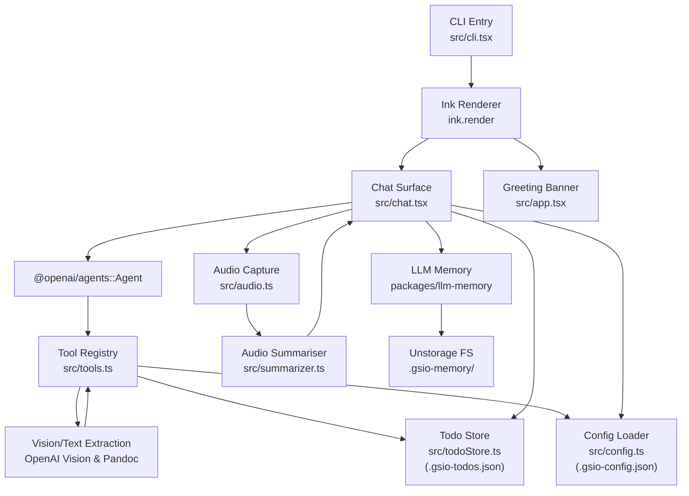
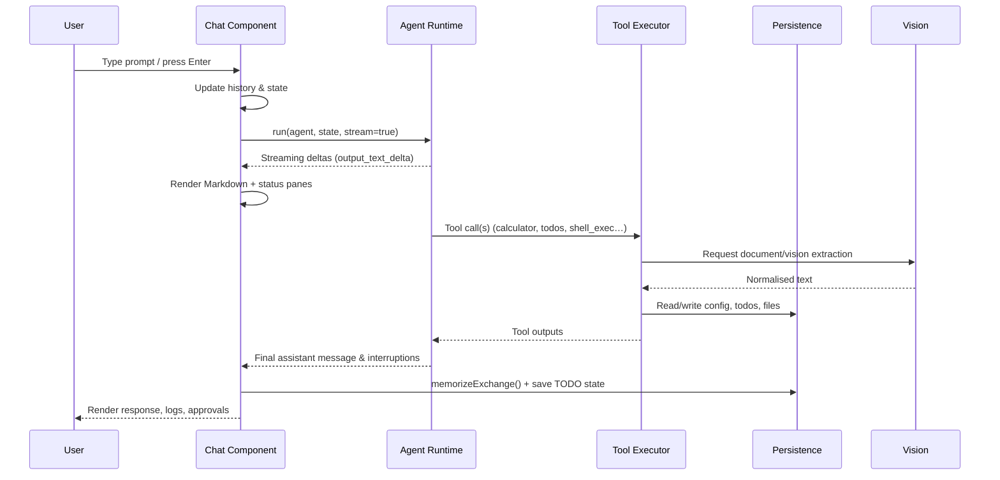
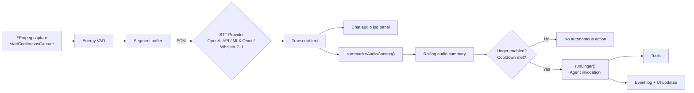

# GSIO Architecture

GSIO is a terminal-first AI assistant that combines an Ink-based React UI with the `@openai/agents` runtime, a configurable tool stack, and optional audio-driven automation. This document outlines the major runtime components and the data flows that tie them together.

## Runtime Topology

At startup the CLI resolves configuration, attaches the Ink renderer, and boots the chat surface. The chat component orchestrates every subsystem: model execution, tool dispatch, UI panels, memory, audio capture, and linger automation.

## Conversation Loop

User keystrokes are tracked in `Chat` (with history, cursor management, debug flags). On submit, the component streams a run through the `@openai/agents` pipeline. Stream events update the live response panel, populate event logs, and surface tool approval interrupts. After each assistant reply the exchange is stored via `LLMMemory`, and the TODO panel is refreshed to reflect tool-driven changes.

## Audio & Linger Automation

The optional audio pipeline streams PCM data from `ffmpeg` into a lightweight energy-based VAD. Segments are transcribed by the configured provider—OpenAI-hosted models, an MLX Omni server (OpenAI-compatible, on-device), or a minimal Whisper CLI bridge. Summaries are consolidated into rolling context that can trigger `linger` runs—autonomous agent passes shaped by the user’s behavior directive and recent audio.

## Model Surfaces & Integrations

- **LLM Provider (`src/llm.ts`)** – Switches between OpenAI’s Responses API and an Ollama-compatible chat completions endpoint. The planning/guidance/execution trio (`.gsio-config.json → ai.models.{reasoning,guidance,execution}`) governs the multi-pass workflow, and the execution model is propagated via `OPENAI_DEFAULT_MODEL`.
- **Vision extraction (`readFileTool` in `src/tools.ts`)** – Attempts Pandoc conversion first; for binary or image-heavy assets it invokes an OpenAI Vision-compatible model using `VISION_EXTRACTION_PROMPT`, returning structured text to the agent.
- **Audio STT (`src/audio.ts`)** – Supports three tiers: OpenAI-hosted transcription models (default `gpt-4o-transcribe`), MLX Omni Server for Apple Silicon/on-device inference, and a lightweight Whisper CLI integration. Whisper support is intentionally slim—choose MLX or OpenAI when you need robust, multi-language coverage.
- **Audio summariser (`src/summarizer.ts`)** – Reuses the main chat model to keep a rolling summary of recent transcripts, respecting provider/base URL overrides.
- **Memory embeddings (`packages/llm-memory`)** – Generates deterministic embeddings internally while surfacing `memory.embeddingModel` for teams aligning with external embedding services. Replacing the embedding generator can be done inside the package without touching the chat loop.

## Persistence & Configuration

- **Configuration (`src/config.ts` / `.gsio-config.json`)** – Central switchboard for provider selection (OpenAI vs Ollama), model overrides, tool approval policy, audio/STT settings, linger cadence, and memory options. The Ink `ConfigMenu` component mutates this file interactively.
- **TODO store (`src/todoStore.ts` / `.gsio-todos.json`)** – Persistent task graph with status, priority, dependency, notes, and focus metadata. Tool invocations keep the JSON canonical and the right-hand panel summarised (`shortList`).
- **Memory (`packages/llm-memory`)** – Stores compressed summaries and keyword metadata in an Unstorage-backed directory (`.gsio-memory/`). Recall happens before each agent run; new exchanges are memorized after responses.

## Key Modules

| Module | Responsibility |
| --- | --- |
| `src/cli.tsx` | Parses CLI flags with `meow`, configures the LLM backend, and renders either the chat surface or config menu. |
| `src/chat.tsx` | Core orchestrator: manages Ink layout, user input, streaming agent runs, tool approvals, TODO panel, event logs, audio hooks, linger automation, and memory integration. |
| `src/tools.ts` | Declares the default toolset (calculator, file IO, HTTP GET, shell_exec, todo management) and enforces config-driven approvals/safety limits. |
| `src/tools.ts` (`readFileTool`) | Bridges Pandoc with OpenAI Vision-based extraction to normalise PDFs, Office docs, and images for downstream LLM use. |
| `src/audio.ts` | Handles continuous capture, VAD segmentation, STT provider selection, and error/metrics reporting. |
| `src/summarizer.ts` | Uses the configured model/provider to maintain a rolling natural-language summary of recent audio context. |
| `packages/llm-memory` | Provides a deterministic embedding + summarisation layer over Unstorage, enabling low-latency recall across sessions. |
| `src/configMenu.tsx` | Ink UI for mutating configuration without leaving the terminal. |
| `src/markdown.tsx` | Converts streaming Markdown into styled Ink primitives for display in the chat window. |

Collectively these pieces give GSIO a modular core: Ink handles presentation, the agent runtime handles reasoning, and config-driven subsystems (tools, memory, audio, linger) can be toggled or swapped without rewiring the CLI.
